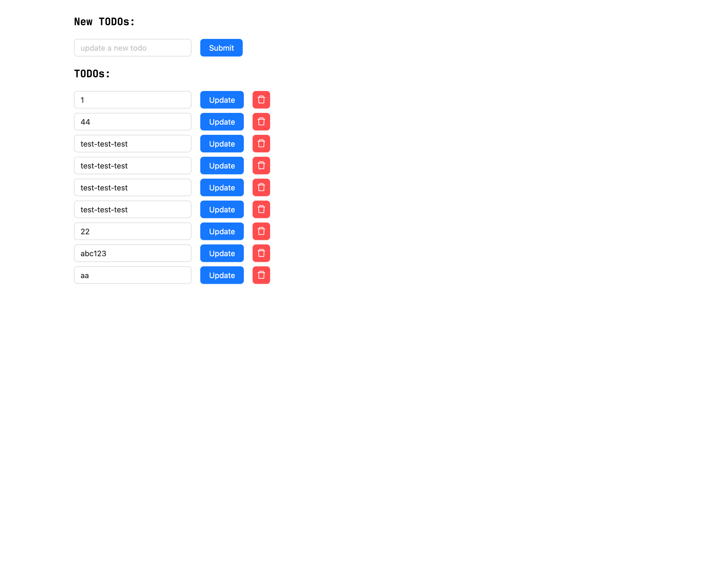

### requirements for local development
- docker
- node


### project setup in docker workspace
```shell
docker run --rm -it \
  --volume $PWD:/app \
  -w /app \
  node:21.6.0-bookworm \
  bash
```

### clearup
```shell
rm -rf ./frontend-esbuild/node_modules
```

### test
```shell
docker run --rm -it \
  --volume $PWD:/app \
  -w /app \
  node:21.6.0-bookworm \
  npx jest
```

### build
```shell
docker run --rm -it \
  --volume $PWD:/app \
  -w /app \
  node:21.6.0-bookworm \
  node esbuild.config.js

# output dir: ./dist
```

### screenshot

